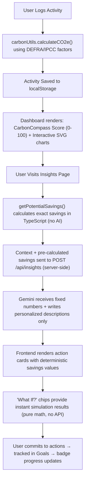

# 🧭 CarbonCompass — Carbon Footprint Awareness Platform

> Navigate your path to lower emissions.

## Live Demo

🌐 [https://carboncompass-851221075870.asia-south1.run.app](https://carboncompass-851221075870.asia-south1.run.app)

Click "Load Demo Data" to experience the full platform instantly.

CarbonCompass is an AI-powered sustainability coach that helps users understand, track, and reduce their carbon footprint through personalized recommendations and actionable insights.

## Chosen vertical

**Sustainability & Environmental Awareness** — an AI-powered sustainability coach that helps individuals understand, track, and reduce their daily carbon footprint through personalized recommendations and actionable insights.

## Approach and logic

CarbonCompass follows a context-aware AI assistant architecture with five layers:

1. **Data collection**: Users log daily activities across 5 categories (Transport, Food, Energy, Shopping, Waste) through a guided multi-step form with real-time CO₂e preview and input validation.

2. **Deterministic emission calculation**: A pure-function calculation engine maps each activity to its CO₂ equivalent using peer-reviewed emission factors from UK DEFRA 2023 and IPCC AR6. Factors are country-specific — India's electricity grid (0.82 kg/kWh) generates 3.5× more CO₂ per kWh than the UK grid (0.233 kg/kWh), and the AI adapts its advice accordingly.

3. **CarbonCompass Score**: A unified 0–100 score combining emissions vs. 1.5°C budget (70 pts), logging streak consistency (14 pts), and tracking coverage across categories (16 pts). The score maps to compass directions (North = On Track, South = Off Course), making the "Compass" branding tangible.

4. **Pre-calculated savings engine**: Before any AI call, `getPotentialSavings()` deterministically calculates exact CO₂ savings for every possible swap based on the user's actual logged data and EMISSION_FACTORS (e.g., "your 45 km of car_petrol → bus saves 5.4 kg/week"). All math is pure TypeScript arithmetic — the LLM never calculates numbers.

5. **AI personalization layer (Gemini 2.5 Flash)**: The pre-calculated savings array and user context are sent to Gemini via a server-side API route (key never exposed to browser). Gemini's role is strictly limited to: selecting the top 3 most impactful swaps and generating personalized, motivating descriptions. Numbers are immutable — Gemini writes the "why" and "how", not the "how much".

6. **"What If?" simulations**: Interactive simulation chips let users test hypothetical changes ("What if I take the bus instead of driving?") with instant deterministic results — no API call needed, pure client-side math.

7. **Gamification loop**: Daily streaks, 6 achievement badges, weekly reduction goals, and committed action tracking create sustained engagement.

### Decision flow diagram



## Key design decisions

1. **Deterministic math, AI personality**: All emission calculations and savings estimates are computed in TypeScript using peer-reviewed DEFRA/IPCC factors. The AI model (Gemini 2.5 Flash) never performs arithmetic — it only generates personalized text descriptions for pre-calculated numbers. This guarantees numerical accuracy while keeping recommendations engaging.

2. **CarbonCompass Score**: A unified 0-100 metric combining budget adherence, logging consistency, and tracking coverage. Maps to compass directions (North = On Track) to make the "Compass" branding functional, not decorative.

3. **"What If?" simulations**: Instant client-side calculations let users test hypothetical behavior changes without API calls. This demonstrates that the app's intelligence doesn't depend entirely on the LLM.

4. **Server-side API key protection**: The Gemini API key is accessed only in a Next.js server-side route, never exposed to the browser. All user inputs are sanitized before reaching the API.

## How the solution works

- **CarbonCompass Score**: Unified 0–100 metric combining budget adherence, streak, and tracking coverage — displayed as the dashboard hero with compass direction ("Heading North — On Track")
- **Activity tracker**: Multi-step guided form with 30+ activity subtypes, real-time CO₂e preview, input sanitization, and inline validation
- **Pre-calculated savings**: `getPotentialSavings()` runs deterministic math on user data before any AI call — Gemini never calculates numbers, only writes personalized descriptions for them
- **AI insights assistant**: Context-aware chat powered by Google Gemini 2.5 Flash with `responseMimeType: 'application/json'` enforcing structured output. Gemini receives pre-calculated savings and user context, returns personalized action descriptions
- **"What If?" simulations**: Interactive chips trigger instant client-side calculations ("switch car → bus saves X.X kg/week") with zero API latency
- **Interactive dashboard**: Custom zero-dependency SVG charts with hover tooltips, keyboard navigation, ARIA labels, and animated stat cards
- **Demo mode**: One-click "Load Demo Data" seeds 14 days of realistic activities so reviewers experience the full platform instantly
- **Goals & achievements**: Weekly CO₂e reduction targets, 6 unlockable badges, streak counter
- **Daily Carbon Insights**: 30 rotating educational tips with real data from IPCC, UNEP, and Our World in Data — a new tip each day with actionable suggestions
- **Editable location**: users can change their country from the profile page, which recalculates electricity emission factors and updates the CarbonCompass Score in real time

## Why AI?

Traditional carbon calculators stop at measurement. CarbonCompass combines a deterministic emissions engine with AI-powered personalization. The TypeScript calculation layer computes exact savings opportunities from the user's real data — AI never performs emission math. Gemini's role is strictly to explain those opportunities in a way that matches the user's country, lifestyle, and recent behavior. This separation means the numbers are always reliable while the advice feels personal and motivating.

## Tech stack

| Layer | Technology | Why |
|-------|-----------|-----|
| Framework | Next.js 14 (App Router) | Server-side API routes protect API key |
| Language | TypeScript (strict) | Compile-time safety, code quality |
| Styling | Tailwind CSS | Utility-first, small bundle |
| AI | Google Generative AI SDK (gemini-2.5-flash) | Fast, structured JSON output |
| Charts | Custom SVG components | Zero dependency, interactive, accessible |
| Icons | lucide-react | Lightweight, tree-shakeable |
| Testing | Vitest | Fast, native ES modules |
| Storage | localStorage | No database needed for personal tracker |

## Setup instructions

```bash
# Clone the repository
git clone https://github.com/YOUR_USERNAME/carboncompass.git
cd carboncompass

# Install dependencies
npm install

# Set up environment variables
cp .env.example .env.local
# Edit .env.local and add your Google Gemini API key:
# GEMINI_API_KEY=your_api_key_here
# Get a key at: https://aistudio.google.com/apikey

# Run development server
npm run dev
# Open http://localhost:3000

# Run tests
npm run test

# Build for production
npm run build
```

## Screenshots

| Dashboard | AI Insights | Tracker |
|-----------|-------------|---------|
|  |  |  |

## Assumptions made

1. **Client-side storage**: Data is stored in localStorage per device. No user accounts, authentication, or cloud sync — appropriate for a personal tracking tool within hackathon scope.
2. **API key security**: The Gemini API key is accessed only server-side in `/api/insights/route.ts` via `process.env`, never exposed to the browser. In production, rate limiting middleware would be added.
3. **Static emission factors**: CO₂e factors are hardcoded from DEFRA 2023 and IPCC AR6. A production version would fetch updated factors from a live API for regional and seasonal accuracy.
4. **Estimation accuracy**: Calculations are estimates for awareness purposes, not certified carbon accounting. The goal is directional accuracy that drives daily behavior change.
5. **Single-user scope**: Designed for individual use. Multi-user social features, carbon offset marketplace, and data sync are planned as future iterations.
6. **Next.js version stability**: Next.js is pinned to 14.2.x for App Router stability. Remaining npm audit advisories relate to image optimization and i18n middleware features not used by this application. A production release would upgrade to Next.js 16.x with full regression testing.

## Data sources

- [UK DEFRA Greenhouse Gas Conversion Factors 2023](https://www.gov.uk/government/collections/government-conversion-factors-for-company-reporting)
- [IPCC Sixth Assessment Report (AR6)](https://www.ipcc.ch/assessment-report/ar6/)
- [Our World in Data — CO₂ and Greenhouse Gas Emissions](https://ourworldindata.org/co2-and-greenhouse-gas-emissions)

## Testing

Run the test suite:
```bash
npm run test
```

Tests cover:
- CO₂e calculation accuracy for all categories and subtypes
- Input sanitization (XSS prevention, HTML stripping, number clamping)
- Validation edge cases (zero inputs, negative values, invalid types)
- localStorage error resilience (corrupted JSON, empty storage)

## License

MIT
